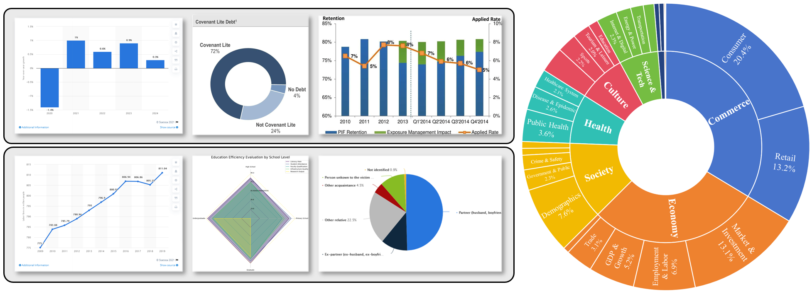

# 📊AgentGER
🏠 *Current Version: v1.0*

This repository contains the code to use AgentGER from the paper [AgentGER: Toward a Human-Aligned Generation–Evaluation–Refinement Paradigm for Figure Understanding].

*🤗 This codebase is released as Version v1.0. We are dedicated to its continuous improvement. If you have any questions or suggestions, you are welcome to open an issue or submit a pull request for new features or bug fixes.*
## 👋 Introduction

Figure-to-text is a key task for assessing figure understanding capabilities of models. Existing approaches face two main challenges: the high cost of constructing high-quality data and the lack of fine-grained, interpretable evaluation aligned with human experts. Accordingly, we propose AgentGER, an agent framework that integrates capabilities of generation, evaluation, and refinement for figure-to-text. AgentGER includes a Generation Model that produces summaries with hierarchical quality levels, an Evaluation Model that performs multi-dimensional, human-aligned assessment with a Chain-of-Evaluation mechanism, and a Refinement Model that improves summaries based on evaluation feedback. We further construct a large-scale dataset with 11,000 summaries and 55,000 multi-dimensional scoring labels through a human–machine collaborative pipeline. Experiments show that AgentGER significantly outperforms all strong baselines, surpasses Gemini-3.0-Pro on evaluation benchmarks, and achieves performance comparable to human experts in both evaluation and refinement tasks.
<p align="center">
  
</p> 

## ⚙ System Architecture

## 📄 Five-Dimensional Scoring Criteria
| Dimension                  | Definition                 | 0 points               | 1 point              | 2 points             |
| -------------------------- | -------------------------- | ---------------------- | -------------------- | -------------------- |
| **Faithfulness**<br> | Whether the summary accurately reflects the facts in the chart |Severe deviation or errors|Generally accurate with biases|Fully faithful to the chart|
| **Completeness**<br> |Whether core elements and main trends are covered|Omission of important content|Covers main info with omissions|Fully covers all key information|
| **Conciseness**<br>  |Whether the expression is concise and high in information density|Redundant or overly brief|Basically concise (optimizable)|Concise and efficient expression|
| **Logicality**<br>   |Whether the logic is coherent and causal relationships are clear|Confused or self-contradictory|Basically coherent with jumps|Clear and consistent logic|
| **Analysis**<br>    |Whether professional terminology is used and analysis depth is achieved|Lack of professionalism|Insufficient professional expression|Accurate terminology and in-depth analysis|

**Scoring Rules**：
- Total Score = Σ(Dimension Score × Weight) × 5, with a full score of 10 points
- Default Weights: Faithfulness 0.35, Completeness 0.25, Conciseness 0.20, Logicality 0.15, Analysis 0.05

**Validation Rules**：
- Total score of the five dimensions ≥ 8 or 9 (out of 10 points)
- **Faithfulness must = 2**
- No dimension score can be 0
- Maximum 3 retries; discard if failed after retries
## 📊 Dataset Details

## 🚀 Quick Start
### Environment Requirements
Python >= 3.8
CUDA >= 11.8
GPU Memory >= 24GB (32GB+ recommended; 30B model requires 80GB+)
### Install Dependencies
```bash
# Method 1: Use installation script
bash install.sh
# Method 2: Use pip
pip install torch torchvision --index-url https://download.pytorch.org/whl/cu118
pip install -r requirements.txt
```
### Dataset Download
Due to anonymity policies and file size limitations, the complete dataset will be released after the paper is accepted.
### Model Preparation
Place the Qwen3-VL-8B-Instruct or Qwen3-VL-30B model in the project root directory
```bash
hf download Qwen/Qwen3-VL-8B-Instruct
```
```bash
project_root/
├── Qwen3-VL-8B-Instruct/   # Base model (8B version)
│   ├── config.json
│   ├── model.safetensors
│   └── ...
├── Qwen3-VL-30B/            # Base model (30B version, optional)
│   └── ...
├── lora_weights/            # LoRA fine-tuning weights
│   ├── l-1/                 # Scoring only (Stage 3)
│   └── l-2/                 # Scoring + Refinement (Stage 2)
└── ...
```
## 🚥 Framework Usage
The overall workflow of the framework is divided into three stages: batch summary generation, single-sample scoring with refined summary generation, and re-scoring validation. The usage of scripts for each stage is as follows:
### Stage 1: Batch Summary Generation
```bash
python main.py feature1 \
    --image_folder ./data/images \
    --low_ratio 0.3 \
    --medium_ratio 0.3 \
    --high_ratio 0.4 \
    --output ./data/output/summaries.jsonl \
    --gpu 0
```
* `--image_folder` Path to the image folder 
* `--low_ratio` Ratio of low-quality summaries (default 0.3)
* `--medium_ratio` Ratio of medium-quality summaries (default 0.3)
* `--high_ratio` Ratio of high-quality summaries (default 0.4)  

🗄️ After running the feature1 branch of [main.py](main.py), summaries of low, medium, and high quality (per the set ratios) will be generated for all images in the image_folder, and results are saved to ./data/output/summaries.jsonl.
### Stage 2: Single-Sample Scoring + Refined Summary Generation
```bash
python main.py feature2 \
    --image ./data/sample.png \
    --summary "Original summary content" \
    --lora_path ./lora_weights/l-2 \  # l-3-distill (better performance) is also available
    --output ./output/result.jsonl \
    --gpu 0
```
🗄️ After running the feature2 branch of [main.py](main.py), the existing summary of sample.png is scored, a refined summary is generated, and results are saved to ./output/result.jsonl.。
### Stage 3: Scoring Validation
```bash
python main.py feature3 \
    --image ./data/sample.png \
    --summary "Summary content to be scored" \
    --lora_path ./lora_weights/l-1 \
    --output ./output/scores.jsonl \
    --gpu 0
```
🗄️ After running the feature3 branch of [main.py](main.py), the refined summary of sample.png is scored, and results are saved to ./output/result.jsonl.
### Full Pipeline: Generate Summary -> Score & Refine -> Quality Validation
```bash
python main.py pipeline1 \
    --image_folder ./data/images \
    --output ./data/output/dataset.jsonl \
    --lora_path_f2 ./lora_weights/l-2 \ # l-3-distill (better performance) is also available  
    --lora_path_f3 ./lora_weights/l-1 \ 
    --max_retries 3 \
    --gpu 0
```
* `--max_retries`：Maximum number of retries; discard if exceeding 3 times
 
🗄️ After running the pipeline1 branch of [main.py](main.py), summaries are generated for all images in the images folder, followed by scoring and refined summary generation, and finally re-scoring of the refined summaries. 

## 🛴 API Usage
In addition to deploying the model locally, the framework functions can also be implemented by calling the API.
### Directory Structure

The directory structure of API scripts is as follows. Please set the API key, endpoint, and model name in `config.py`.
```bash
api_pipeline/
├── __init__.py           # Package initialization
├── config.py             # API configuration (key, endpoint, model name)
├── api_model.py          # API calling module (supports multimodal input)
├── feature2_evaluate.py  # API version of Feature 2 (Scoring + Refine Summary)
├── feature3_score.py     # API version of Feature 3 (Scoring Only)
├── pipeline.py           # API version of pipeline implementation
└── main.py               # Command-line entry
```
### Script Usage

```bash
# Score existing summaries, generate refined versions, and validate refinement quality via re-scoring:
python api_pipeline/main.py pipeline1 --input ./data/output/dataset_step1.jsonl --output ./data/output/dataset_api.jsonl
```

```bash
# Refine the summary of a single image
python api_pipeline/main.py pipeline2 --image ./data/sample.png --summary "Original summary"
```
```bash
# Directly score a single image's summary
python api_pipeline/main.py pipeline3 --image ./data/sample.png --summary "Summary to be scored"
```
## 🚧 LoRA Fine-Tuning
### Scheme Description
| Scheme| Output Content                      | Applicable Scenario         | Corresponding Stage|Training Method|
| ---- | -------------------------------------| ----------------------------| --------| -------- |
| l-1  | Score + Reason + Weight              | Scoring only                |Stage 3  |Standard Training|
| l-2  |Score + Reason + Weight + improved_summary| Scoring + Refinement    |Stage 2   |Standard Training|
| l-3-distill |Score + Reason + Weight + improved_summary|Enhanced Scoring + Refinement|Stage 2   | **Knowledge Distillation** |
#### Knowledge Distillation Description：
* Teacher Model: l-2 (Scoring-only model)
* Student Model: l-3-distill (Model with both scoring and refinement capabilities)
* Training with knowledge distillation solves the catastrophic forgetting problem while maintaining high-quality scoring and refinement capabilities.
 
🗄️ Perform LoRA fine-tuning on Qwen3-VL-8B-Instruct: fine-tune with a scoring-only dataset to obtain `l-1`, and fine-tune with a dataset containing scores and refined summaries to obtain `l-2`. After obtaining l-2, use l-2 as the teacher model and perform knowledge distillation with a mixed dataset (scoring dataset + scoring + refined summary dataset) to obtain `l-3-distill`, which maintains both high-quality scoring and refinement capabilities.
### Training Steps
#### Step 1: Data Preparation
```bash
python training/data_format.py \
    --input data/output/dataset.jsonl \
    --generate-both
``` 
* `--dataset.jsonl`is the original dataset  
 
 🗄️ Generate two scripts (training_data_l1.json for l-1 scoring-only training data, training_data_l2.json for l-2 scoring + refinement training data) from the original dataset `data/output/dataset.jsonl`.    
 
**Data Format** 
```json
[
  {
    "image": "data/images/1.png",
    "conversations": [
      {
        "role": "user",
        "content": "Evaluation prompt + Original summary"
      },
      {
        "role": "assistant",
        "content": "<evaluation>{...}</evaluation>[<modification>{...}</modification>]"
      }
    ]
  }
]
```
#### Step 2: Model Training
```bash
# Scoring only (l-1, Stage 3)
python main.py train \
    --model_path ./Qwen3-VL-8B-Instruct \
    --data_path ./data/output/training_data_l1.json \
    --output_dir ./lora_weights/l-1 \
    --scheme l-1 \
    --lora_r 64 \
    --lora_alpha 128 \
    --learning_rate 2e-4 \
    --num_epochs 3 \
    --batch_size 1 \
    --gradient_accumulation_steps 8
```
* `--lora_r`LoRA rank
* `--lora_alpha`LoRA scaling factor  

 🗄️ Use Qwen3-VL-8B-Instruct as the base model and fine-tune with `training_data_l1.json` for scoring to obtain ./lora_weights/l-1.
```bash
# Scoring + Refinement (l-2, Stage 2)
python main.py train \
    --model_path ./Qwen3-VL-8B-Instruct \
    --data_path ./data/output/training_data_l2.json \
    --output_dir ./lora_weights/l-2 \
    --scheme l-2 \
    --lora_r 64 \
    --lora_alpha 128 \
    --learning_rate 2e-4 \
    --num_epochs 3 \
    --batch_size 1 \
    --gradient_accumulation_steps 8
```
 🗄️ Use Qwen3-VL-8B-Instruct as the base model and fine-tune with training_data_l2.json for scoring and refinement to obtain ./lora_weights/l-2.
```bash
# Scoring + Refinement (l-3-distill, Stage 2)
python training/train_lora_distill.py \
    --base_model_path ./Qwen3-VL-8B-Instruct \
    --teacher_lora_path ./lora_weights/l-2 \
    --score_data_path ./data/output/training_data_l2.json \
    --refine_data_path ./data/output/training_data_l1.json \
    --output_dir ./lora_weights/l-3-distill \
    --lora_r 64 \
    --lora_alpha 128 \
    --learning_rate 1e-4 \
    --num_epochs 3 \
    --batch_size 1 \
    --gradient_accumulation_steps 8 \
    --distill_beta 0.5 \
    --replay_gamma 0.3 \
    --temperature 2.0 \
    --score_ratio 0.3
```
* `--distill_beta`Distillation loss weight
* `--replay_gamma`Experience replay loss weight
* `--temperature`Distillation temperature
* `--score_ratio`Ratio of scoring data in mixed data (default 0.3, i.e., 30% scoring data + 70% refinement data)  
  
🗄️ Use l-2 as the teacher model and perform knowledge distillation with a mixed dataset (scoring dataset + scoring + refinement summary dataset) to obtain `l-3-distill`, which maintains both high-quality scoring and refinement capabilities.
## 📜 License
Our original data contributions are distributed under the MIT license.

